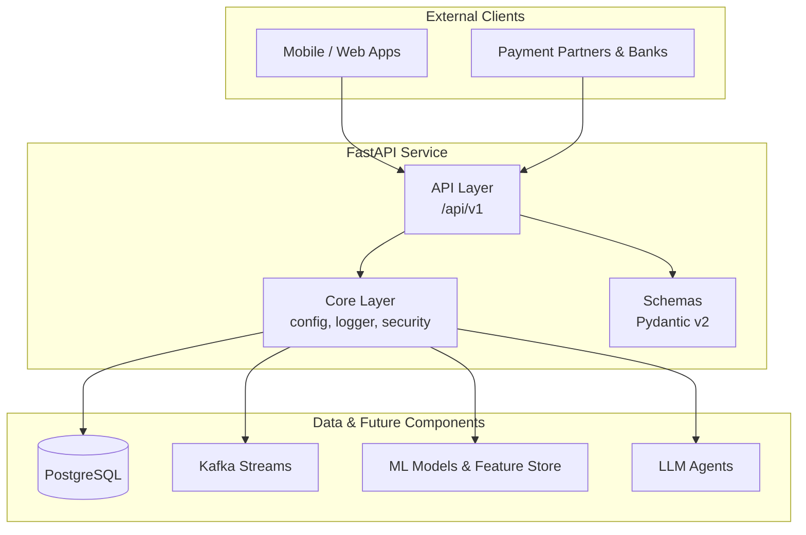

# Transaction Processing Service

**Production-grade FastAPI template** built as the foundation for my **AI Engineer / ML Engineer portfolio** (Fintech domain).

---

## Overview

Clean Architecture (`src/` layout) backend service designed with real production standards in mind.
This skeleton will be extended with:
- Real-time transaction processing (Kafka)
- Fraud detection (Classical ML + LLM)
- RAG/Agent capabilities
- Full MLOps pipeline

## Architecture

