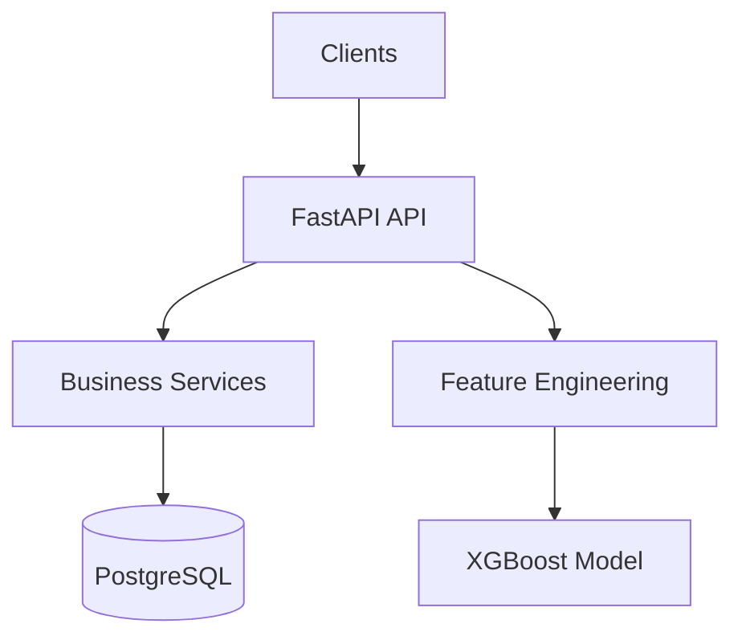

# Transaction Processing Service

**Production-grade FastAPI + Machine Learning backend** for transaction validation, analytics, and real-time fraud detection.

[]()
[]()
[]()
[]()

---

## Overview

An end-to-end transaction processing platform that:

* Validates payment transactions
* Persists transactional data
* Generates statistical insights
* Detects fraudulent activity in real time using Machine Learning

This project serves as a portfolio project demonstrating backend engineering, data engineering, and machine learning skills within a fintech domain.

---

## Features

### Transaction Processing

* Transaction validation API
* Business rule enforcement
* Pydantic v2 request/response schemas
* Structured logging

### Data Layer

* PostgreSQL persistence
* SQLAlchemy ORM
* Alembic database migrations
* Dockerized local development environment

### Analytics

* Transaction statistics endpoint
* Aggregated metrics and reporting
* Data exploration capabilities

### Machine Learning

* Feature engineering pipeline
* XGBoost fraud detection model
* Real-time prediction endpoint
* Model evaluation and experimentation workflow

---

## Architecture



---

## API Endpoints

| Method | Endpoint                 | Description                     |
| ------ | ------------------------ | ------------------------------- |
| POST   | `/transactions/validate` | Validate and store transactions |
| GET    | `/transactions/stats`    | Retrieve transaction analytics  |
| POST   | `/transactions/predict`  | Predict fraud probability       |

---

## Quick Start

### 1. Start PostgreSQL

```bash
docker compose up -d postgres
```

### 2. Install Dependencies

```bash
uv sync
uv pip install -e .
```

### 3. Run Database Migrations

```bash
uv run alembic upgrade head
```

### 4. Start the Application

```bash
uv run uvicorn app.main:app --reload
```

Swagger UI:

```text
http://localhost:8000/docs
```

---

## Tech Stack

### Backend

* FastAPI
* Uvicorn
* Pydantic v2

### Database

* PostgreSQL
* SQLAlchemy
* Alembic

### Machine Learning

* XGBoost
* scikit-learn
* pandas
* NumPy

### DevOps & Tooling

* Docker
* uv
* pre-commit
* GitHub Actions

---

## Roadmap

* [x] Transaction Validation API
* [x] PostgreSQL Integration
* [x] Analytics Endpoint
* [x] XGBoost Fraud Detection
* [ ] Model Monitoring
* [ ] Feature Store
* [ ] Streaming Ingestion (Kafka)
* [ ] CI/CD Deployment
* [ ] Cloud Infrastructure (GCP/AWS)

---
