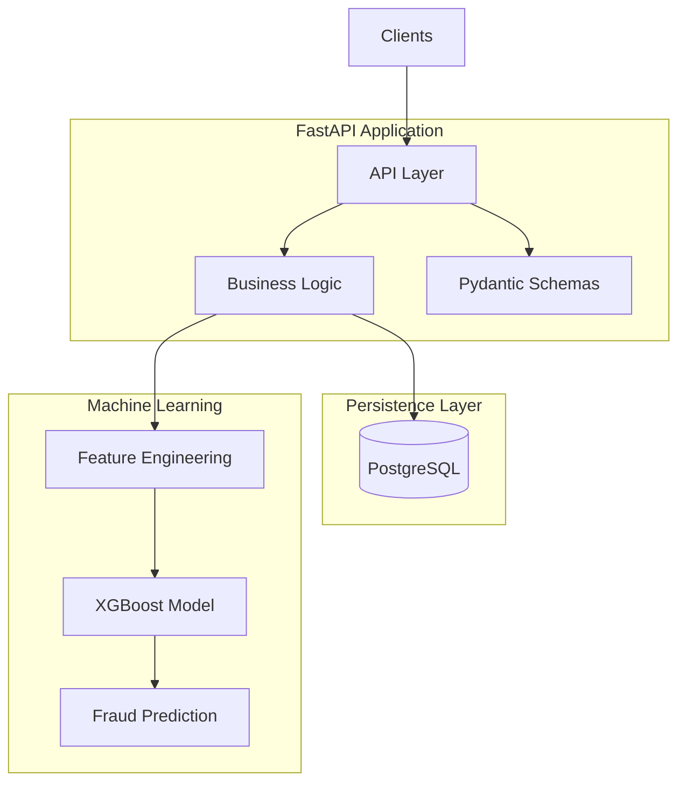

# Transaction Processing Service

**Production-grade FastAPI + Machine Learning backend** for transaction validation, analytics, and real-time fraud detection.

---

## Overview

Transaction Processing Service is an end-to-end backend system that simulates a fintech transaction pipeline. The platform validates incoming transactions, persists data to PostgreSQL, generates statistical insights, and performs real-time fraud detection using a trained XGBoost model.

The project demonstrates backend engineering, data engineering, and machine learning integration within a single production-style service.

---

## Core Features

### Transaction Validation

* Validate incoming transaction requests
* Risk scoring and business rule enforcement
* Pydantic v2 request/response schemas
* Structured logging

### Data Persistence

* PostgreSQL database
* SQLAlchemy ORM
* Alembic database migrations
* Dockerized development environment

### Analytics

* Transaction statistics and aggregation
* Risk distribution analysis
* Basic anomaly detection
* Operational insights API

### Machine Learning

* Feature engineering pipeline
* XGBoost fraud detection model
* Scikit-learn preprocessing workflow
* Real-time prediction endpoint

### Engineering Practices

* Clean project structure
* Environment-based configuration
* Pre-commit hooks
* Docker support
* GitHub Actions CI/CD

---

## System Architecture



---

## API Endpoints

| Method | Endpoint                 | Description                    |
| ------ | ------------------------ | ------------------------------ |
| POST   | `/transactions/validate` | Validate and store transaction |
| GET    | `/transactions/stats`    | Retrieve transaction analytics |
| POST   | `/transactions/predict`  | Generate fraud prediction      |

---

## Technology Stack

### Backend

* FastAPI
* Uvicorn
* Pydantic v2

### Database

* PostgreSQL
* SQLAlchemy
* Alembic

### Machine Learning

* XGBoost
* Scikit-learn
* Pandas
* NumPy

### DevOps & Tooling

* Docker
* uv
* GitHub Actions
* pre-commit

---

## Quick Start

### 1. Start PostgreSQL

```bash
docker compose up -d postgres
```

### 2. Install Dependencies

```bash
uv sync
uv pip install -e .
```

### 3. Run Database Migrations

```bash
uv run alembic upgrade head
```

### 4. Start the Application

```bash
uv run uvicorn app.main:app --reload
```

### 5. Open API Documentation

```text
http://localhost:8000/docs
```

---

## Example Workflow

1. Submit a transaction for validation
2. Persist transaction data to PostgreSQL
3. Generate statistical metrics
4. Extract fraud-detection features
5. Run XGBoost inference
6. Return fraud probability and prediction result

---

## Future Enhancements

* Redis caching
* Asynchronous processing with Kafka
* Model versioning
* Monitoring and observability
* Feature store integration
* Container orchestration with Kubernetes

---
