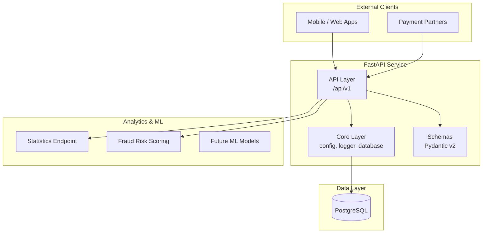

# Transaction Processing Service

**Production-grade FastAPI template** built as the foundation for my **AI Engineer / ML Engineer portfolio** (Fintech domain).

---

## Overview

A clean architecture transaction processing service with:
- Real-time transaction validation API
- PostgreSQL persistence with SQLAlchemy + Alembic
- Statistical analytics & risk scoring
- Ready for ML models and LLM agents

## Architecture

