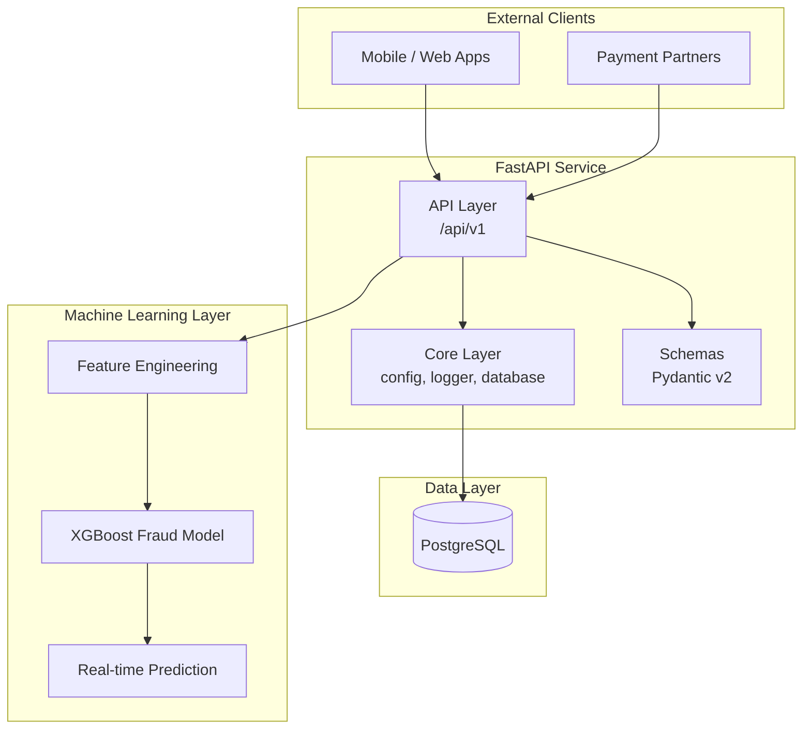

# Transaction Processing Service

**Production-grade FastAPI + ML backend** — Core project for my **AI/ML Engineer portfolio** (Fintech domain).

---

## Overview

End-to-end transaction processing system with validation, persistence, statistical analytics, and **machine learning-powered fraud detection**.

**Current Progress:** End of **Week 4 (Month 1)** — Classical Machine Learning.

## Features

### Production Python & FastAPI

* `POST /transactions/validate` — Rule-based risk scoring
* Structured logging
* Pydantic v2 validation

### Data Layer

* PostgreSQL
* SQLAlchemy ORM
* Alembic migrations
* Automatic transaction persistence

### Statistics & Analytics

* `GET /transactions/stats` — High-performance statistical analytics (optimized single-query db aggregation)
* Distribution analysis
* Anomaly detection

### Machine Learning

* Feature engineering pipeline with aligned rule-based scoring feature alignment
* **XGBoost fraud detection model**
* `POST /transactions/predict` — Real-time fraud prediction
* `POST /transactions/train` — Asynchronous background retraining and in-memory model hot-reloading

## Architecture



## API Endpoints

| Method | Endpoint                 | Description                       |
| ------ | ------------------------ | --------------------------------- |
| POST   | `/transactions/validate` | Validate and persist transactions                          |
| GET    | `/transactions/stats`    | Statistical analytics                                      |
| POST   | `/transactions/predict`  | ML-powered fraud prediction                                |
| POST   | `/transactions/train`    | Trigger asynchronous XGBoost training and model hot-reload |

## Tech Stack

### Backend

* FastAPI
* Uvicorn

### Database

* PostgreSQL
* SQLAlchemy
* Alembic

### Machine Learning

* XGBoost
* scikit-learn
* pandas

### Tooling

* uv
* Docker
* pre-commit
* GitHub Actions

## Quick Start

```bash
# Start PostgreSQL
docker compose up -d postgres

# Install dependencies
uv sync

# Apply database migrations
uv run alembic upgrade head

# Run API
uv run uvicorn src.app.main:app --reload
```

---
